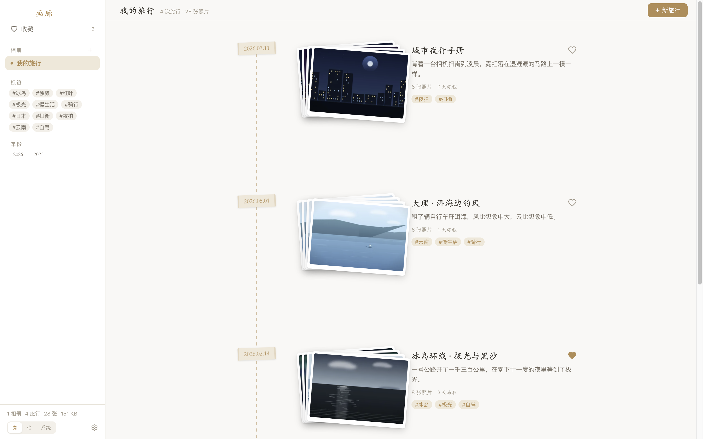
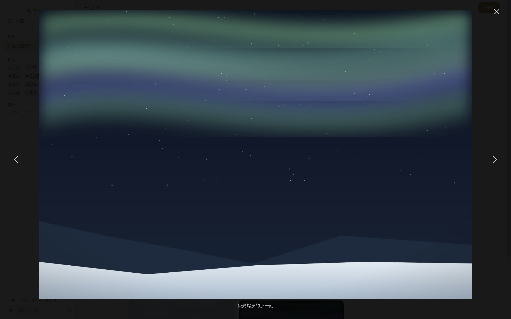
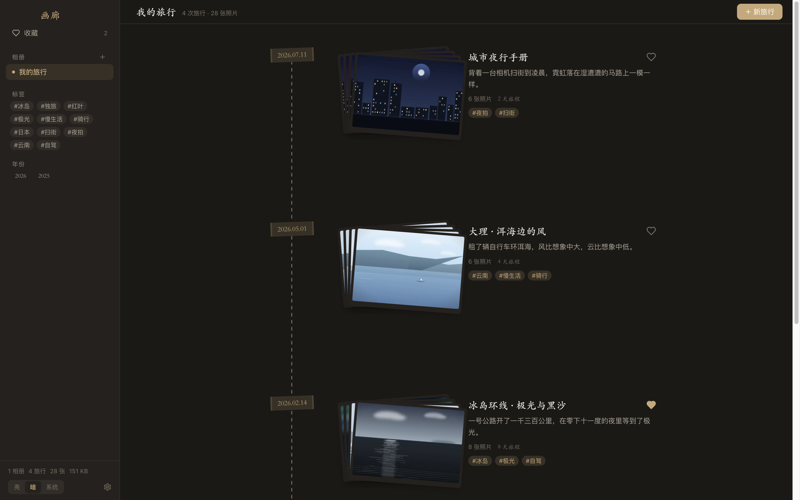

# 画廊 · 把旅行照片，做成一本翻不腻的手账

<p align="center">
  
</p>

<p align="center">
  <a href="https://github.com/mangococo/gallery/releases/latest"></a>
  <a href="https://github.com/mangococo/gallery/actions/workflows/release.yml"></a>
  
  <a href="LICENSE"></a>
</p>

**画廊**是一款本地优先的旅行照片管理桌面应用。它不把照片锁进自己的图库，而是把你已有的照片文件夹，变成一条按日期排开的手账时间线——拍立得堆叠、和纸胶带日期贴、缝线书脊。点开一本，就是那次旅行的照片墙。

不需要联网，不需要登录，不会后台上传。照片在哪里，永远由你说了算。

## 为什么选画廊

- **照片原地不动** — 注册你已有的照片文件夹，文件零拷贝、零改名；拔掉相册目录，应用数据分毫未损，插回即恢复
- **数据完全属于你** — 元数据存本地 SQLite 单文件，删掉应用也只是一行 `rm`；没有账号、没有云、没有追踪
- **好看得像手账，快得像原生** — React + Electron，缩略图由 sharp 预生成，万张照片的时间线照样流畅滚动

## 界面一览

| 手账时间线 | 旅行照片墙 |
|---|---|
|  |  |
| **灯箱看图** | **烛光暗色主题** |
|  |  |

## 功能特性

- 📅 **时间线视图** — 按开始日期倒序的手账时间线：缝线书脊、和纸胶带日期贴、拍立得照片堆叠（悬停散开，最多 9 张）
- 🗂 **多相册** — 注册多个照片根目录，一次激活一个，快速切换；外置卷拔出时灰显、插回即恢复
- 🌗 **主题** — 亮 / 暗 / 跟随系统三态，暗色为暖褐「烛光」调，跟随系统深色模式联动
- 🏷 **标签 / 收藏 / 年份** — 三类筛选可叠加，标签输入带常用联想
- 🖼 **照片墙 + 灯箱** — 瀑布流缩略图（sharp 生成 400px webp），灯箱看原图，←/→ 切换、ESC 退出
- 🍎 **HEIC / HEIF** — iPhone 原片可直接导入：内置 WASM 解码生成缩略图，查看时自动转为兼容格式（EXIF 拍摄时间与 GPS 照常读取）
- 🎬 **视频播放** — 视频自动截帧生成海报帧，灯箱内直接拖进度条（`gallery-media://` 协议支持 Range）
- ✏️ **行内编辑** — 标题、日期、描述、标签随手改；一键指定封面照片
- 📥 **多种导入** — 表单上传、拖拽照片/视频进窗口即导入；一键迁移旧版 `.settings.json` 数据目录
- 👁 **实时同步** — 监听相册目录，Finder 里增删照片立刻反映；也可手动重新扫描
- 🗑 **安全删除** — 照片与旅行目录一律移入系统废纸篓，可反悔

## 下载安装

前往 [**Releases**](https://github.com/mangococo/gallery/releases/latest) 下载最新版本：

| 平台 | 文件 |
|---|---|
| macOS（Apple Silicon） | `gallery-<版本>-mac-arm64.dmg` |
| Windows 10/11（64 位） | `gallery-<版本>-win-x64.exe` |

> **首次运行提示**：安装包目前未做代码签名（没钱买苹果开发者证书 😅）
> - **macOS**：打开 dmg 拖入「应用程序」后，首次启动若提示无法验证开发者，到「系统设置 → 隐私与安全性」点击**「仍要打开」**即可；也可以在终端执行一次 `xattr -cr /Applications/画廊.app`。macOS 15 起旧的「右键 → 打开」绕过已被移除
> - **Windows**：SmartScreen 弹窗时点击「更多信息 → 仍要运行」

## 数据与文件

| 内容 | 位置 |
|---|---|
| 应用数据库 | `~/Library/Application Support/画廊/gallery.db` |
| 缩略图缓存 | `~/Library/Application Support/画廊/thumbnails/` |
| 照片文件 | **原地不动**，仅在注册的相册目录内 |

移除相册 / 清除应用数据都不会删除照片文件。

## 开发

```bash
npm install        # 安装依赖（better-sqlite3 / sharp 为 NAPI 预编译，无需手动 rebuild）
npm run dev        # 启动开发模式（HMR）
npm run typecheck
npm run build:mac  # 产出 release/gallery-<版本>-mac-arm64.dmg
```

推送 `v*` 标签时，[Release CI](.github/workflows/release.yml) 会自动构建 macOS / Windows 安装包并创建 GitHub Release。

### 验收截图工具

```bash
# GALLERY_E2E=1 时按步骤文件驱动 UI 并截图到指定目录，最后自动退出
GALLERY_E2E=1 \
GALLERY_E2E_DIR=/tmp/gallery-e2e \
GALLERY_E2E_STEPS=steps.json \
GALLERY_E2E_ALBUM="/path/to/相册目录" \
npx electron .
```

README 中的界面截图由 `scripts/gen-demo.mjs` 生成的演示相册驱动应用截取，可复现。

## 架构

```
src/
├── main/          # 主进程：SQLite、扫描器、缩略图队列、协议、watcher
│   └── services/  # scanner / thumbnails / watcher
├── preload/       # contextBridge 类型化 window.api
├── renderer/      # React 18 + Tailwind v4（语义 token，零 dark: 前缀）
└── shared/        # 领域类型与 IPC 通道定义
```

渲染进程不直接触碰文件系统与数据库，一切经类型化 IPC；安全边界由 contextIsolation + 路径越界校验保证。

## License

[MIT](LICENSE)
